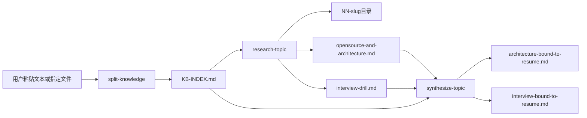

# Interview Knowledge Track（面试知识点三阶段追踪）

## 权威切片与参考

- **分步执行的详细指令**以本 skill 目录下 `prompts/` 为唯一必需依据。
- 若工作区里另有用户自维护的「架构/面试」长提示词，仅可在不冲突时作语气参考；**非必需**，也不假定其路径或文件名。

## 目标与边界

- **目标**：用三条英文命令驱动「拆知识点 → 按点检索沉淀 → 结合候选人自述文本做架构+面试合成」，定位表述中的薄弱技术点。
- **输入**：第一步仅使用用户**粘贴内容**，或用户**显式给出路径**并要求读取的文件；**不**假定、不自动加载工作区内任何其它文件。
- **写操作范围**：默认只在用户约定的工作根目录（见下）内创建/更新 `KB-INDEX.md` 与主题子目录下的 Markdown；**不**把本 skill 与任意「默认简历文件」绑定。

## 英文命令（用户口述即可）

| 命令 | 含义 |
|------|------|
| `split-knowledge` | 第一步：拆分知识点，生成/更新索引 `KB-INDEX.md` |
| `research-topic` | 第二步：对某一知识点检索，写入该主题目录下两个 MD，并回写索引状态 |
| `synthesize-topic` | 第三步：在指定知识点目录下，依据索引原文 + 第二步产出，写「与本人经历绑定」的两份 MD |

**别名（可选）**：`kp-split` → `split-knowledge`；`topic-research` → `research-topic`；`topic-synthesize` → `synthesize-topic`。

## 工作根目录与文件命名

- **工作根目录**：用户指定则用之；否则默认为**项目根目录下** `interview-knowledge-track/`。
- **第一步产出**：`<root>/KB-INDEX.md`（用户可指定其他路径/文件名，但**同一会话**后续步骤必须能唯一定位该索引）。
- **主题目录**：`<root>/NN-slug/`，例如 `01-langchain`。`NN` 为两位序号，与知识单元表顺序一致；`slug` 小写、连字符。
- **第二步文件**（固定文件名）：
  - `opensource-and-architecture.md` — 开源/博客/论文检索 + 架构与模块拆解，**全文落盘**。
  - `interview-drill.md` — 精准关键词检索 + 概念补充 + 追问与参考答案，**全文落盘**。
- **第三步文件**（与第二步同主题目录，除非用户另指定）：
  - `architecture-bound-to-resume.md`
  - `interview-bound-to-resume.md`

## 第一步索引契约（`KB-INDEX.md`）

生成或更新 `KB-INDEX.md` 时必须包含：

1. **原文保留区**：完整粘贴用户输入（或注明读取的文件路径 + 可选校验信息如段落范围/哈希），满足不丢失原信息。
2. **知识单元表**：每行至少包含：`序号`、`知识点名称`、`slug`、`来源原文摘录`（精确到句）、`状态`、`对应目录`。
3. **拆分规则**：技术栈/框架/领域词拆为可独立检索单元；同一句话可对应多个单元（摘录可重复或附注「共现句」）。
4. **元数据**：生成日期、工作根路径。

### 状态枚举与回写规则

| 状态 | 含义 |
|------|------|
| `pending` | 尚未执行第二步 |
| `researched` | 第二步已完成：`NN-slug/` 下已写入 `opensource-and-architecture.md` 与 `interview-drill.md`，且索引中 `对应目录` 已填写 |
| `synthesized` | 第三步已完成：同目录下已写入 `architecture-bound-to-resume.md` 与 `interview-bound-to-resume.md` |

- **第二步完成后**：将该知识点行的 `状态` 改为 `researched`，并写回 `对应目录`（如 `01-langchain`）。
- **第三步完成后**：将该知识点行的 `状态` 改为 `synthesized`。

## Agent 执行要点

### `split-knowledge`

- 创建或更新 `<root>/KB-INDEX.md`，遵守上文契约。
- 聊天中仅给出路径、主题数量与 slug 列表等短摘要。

### `research-topic`

- 用户需指定**当前主题**（序号、slug 或知识点名称）与工作根/索引路径（若与默认不同）。
- 读取 `prompts/step2-architecture.md` 与 `prompts/step2-interview-drill.md`，使用 **Web 检索** 满足检索要求。
- 将完整内容写入主题目录下两个 MD；聊天仅回复路径与 1–3 句摘要。
- 更新 `KB-INDEX.md` 中该行状态为 `researched`。

### `synthesize-topic`

- **强制输入顺序**：① `KB-INDEX.md`（全文至少使用「原文保留区」+ 当前主题在知识单元表中的行）；② 当前主题目录下第二步两个文件；③ `prompts/step3-synthesis.md`。
- 写入 `architecture-bound-to-resume.md` 与 `interview-bound-to-resume.md`；聊天仅路径与极短摘要。
- 将 `KB-INDEX.md` 中该行状态改为 `synthesized`。

## 质量自检（执行后自查）

- **第一步**：每条知识点是否在「原文保留区」中有逐字或可核对的摘录依据。
- **第二步**：两个 MD 是否均含检索关键词与来源/诚信声明；**禁止伪造** GitHub 链接或论文。
- **第三步**：架构段落与每道面试题是否能回答「对应第一步哪一句/哪一项目」；技术与链路与第二步一致，无无出处杜撰。

## 流程示意

