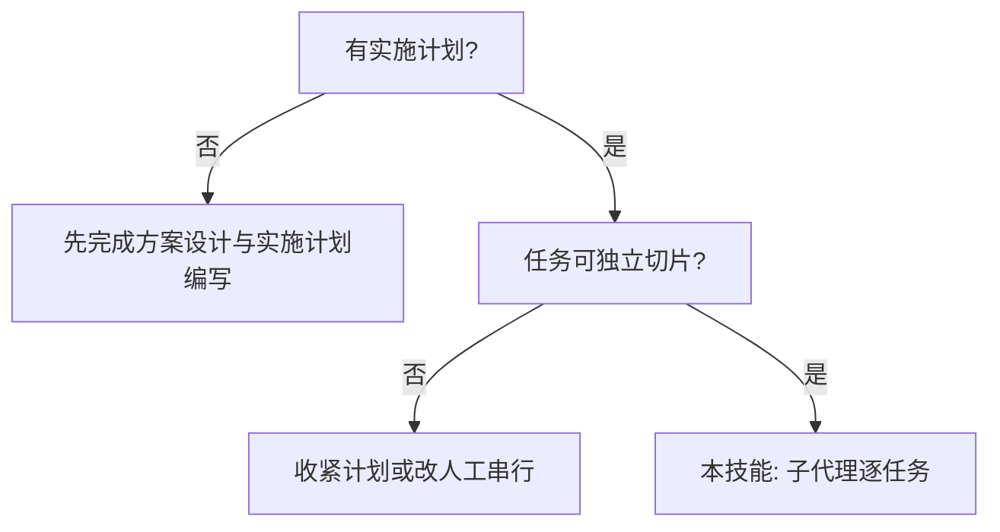

# 子代理驱动开发

按**书面实施计划**逐任务推进：每个任务派发**新的实现子代理**（隔离上下文），任务完成后依次做 **规格符合性审查 → 代码质量审查**（顺序不可颠倒）。主会话负责读计划一次、提取任务全文、协调与决策，不把整段对话历史灌给子代理。

**开场声明：**「我正在使用**子代理驱动开发**技能执行计划。」

**与「同会话逐步执行」的区别：** 本技能强调**每任务新子代理 + 双审查**；若用户选择在当前会话手写每一步、不用 Task 派子代理，可改按 `references/inline-execution-hint.md` 配合 `tdd-master（TDD 开发大师）` 与 `code-review-expert（代码审查专家）`，不再套用下文的 Task 模板。

---

## Inputs / Outputs / Gates / Handoffs（统一契约）

- **Inputs（最小输入）**：一份书面实施计划（必须包含任务全文：步骤、代码块、命令、预期输出）；当前分支/工作目录信息。
- **Outputs（产物形态）**：按任务推进的执行记录（主会话 Todo 勾选）+ 每任务的 3 段产物：实现结果、规格符合性审查、代码质量审查。
- **Gates（继续前必须满足）**：
  - 不允许子代理自行打开计划文件代替你粘贴任务全文（除非平台强制且无法粘贴，并需说明风险）。
  - 审查顺序硬门控：**先规格符合性审查 → 后代码质量审查**。
  - 发现阻塞问题必须回到实现修复并复审，通过后才进入下一任务。
- **Handoffs（推荐下游）**：
  - `code-review-expert（代码审查专家）`：整体收尾审查/质量门禁
  - `debug-expert（调试专家）`：实现或测试失败时切换排查

## 适用条件

- 已有实施计划（推荐由 `writing-plans（实施计划编写）` 产出），任务粒度小、相对独立。
- 平台支持 **Task / 子代理** 等派发能力；若不支持，改用同会话执行提示文件。



---

## 总流程

1. **读计划一次**，提取全部任务标题与**完整任务正文**（含步骤、代码块、命令），**不要让子代理自己去读计划文件**。
2. 用 TodoWrite（或等价方式）列出所有任务，随进度更新。
3. **对每个任务**循环：
   - 派发 **实现子代理**（`references/implementer-prompt.md`）
   - 根据返回状态处理（见下节「实现者状态」）
   - 通过后派发 **规格符合性审查**（`references/spec-reviewer-prompt.md`）
   - 规格 ✅ 后派发 **代码质量审查**（`references/code-quality-reviewer-prompt.md`，对齐 `code-review-expert（代码审查专家）` 的严重度与证据要求）
   - 两道审查均未决问题后，勾选任务完成
4. **全部任务完成后**：建议对整体变更再做一次 `code-review-expert（代码审查专家）` 级别的汇总审查（可再派子代理），并请用户确认合并/PR；若项目后续提供「分支收尾」类技能可再衔接。

---

## 实现者状态处理

实现子代理须返回以下之一：

| 状态 | 处理 |
|------|------|
| **DONE** | 进入规格符合性审查 |
| **DONE_WITH_CONCERNS** | 先阅读关切；涉及正确性/范围的先处理再审查；仅为观察性备注可记录后继续 |
| **NEEDS_CONTEXT** | 补充上下文后重新派发同一任务 |
| **BLOCKED** | 缺信息则补上下文；能力不足则换更强模型；任务过大则拆计划；计划错误则上升用户 |

**禁止**忽视 BLOCKED、禁止无变更重复派发同模型硬重试。

---

## 模型选用（节省成本）

- **机械实现**（1–2 文件、规格完整）：较快、较省模型。
- **多文件集成与判断**：标准能力模型。
- **架构与审查**：在可用范围内选最强模型。

---

## 提示词模板（必读路径）

| 文件 | 用途 |
|------|------|
| `references/implementer-prompt.md` | 实现子代理 |
| `references/spec-reviewer-prompt.md` | 规格符合性审查（先） |
| `references/code-quality-reviewer-prompt.md` | 代码质量审查（后） |

派发时将计划中的**任务全文**粘贴进提示词，并补充场景上下文（依赖、架构位置、工作目录）。

---

## 红线（禁止）

- 未经用户明确同意在 `main`/`master` 上开始改代码。
- 跳过任一审查，或**先代码质量、后规格符合**（顺序错误）。
- **并行**派发多个实现子代理处理同一仓库同一分支（易冲突）。
- 让子代理自行打开计划文件代替你粘贴任务全文（除非平台强制且无法粘贴，此时应最小化摘录并说明风险）。
- 审查发现问题后不修复、不复审就进入下一任务。
- 用实现者自述替代审查员的**独立读码**验证。

---

## 与项目内技能的衔接

| 技能 | 作用 |
|------|------|
| `writing-plans（实施计划编写）` | 产生本技能消费的勾选式计划 |
| `tdd-master（TDD 开发大师）` | 实现与运行测试时应遵循 RED-GREEN-REFACTOR；计划中已拆步骤时以计划为准 |
| `code-review-expert（代码审查专家）` | 代码质量审查输出结构与严重度对齐；全量收尾可再显式调用 |
| `debug-expert（调试专家）` | 实现或测试失败时切换排查 |

---

## 示例（缩写）

```
[读取计划 docs/specs/plans/xxx.md，提取任务 1–N 全文，写入 Todo]

任务 1：
  → Task: implementer（全文任务 + 上下文）
  → 实现者 DONE
  → Task: spec reviewer → ✅
  → Task: code quality reviewer → 有 Important 问题 → 实现者修复 → 再审 → ✅
  → 标记任务 1 完成

任务 2：…

全部完成后 → 可选：Task 最终审查 → 用户确认合并
```

更多叙事化示例见 superpowers 上游项目中的同名技能；本仓库为中文流程与 `code-review-expert（代码审查专家）` 对齐版。
